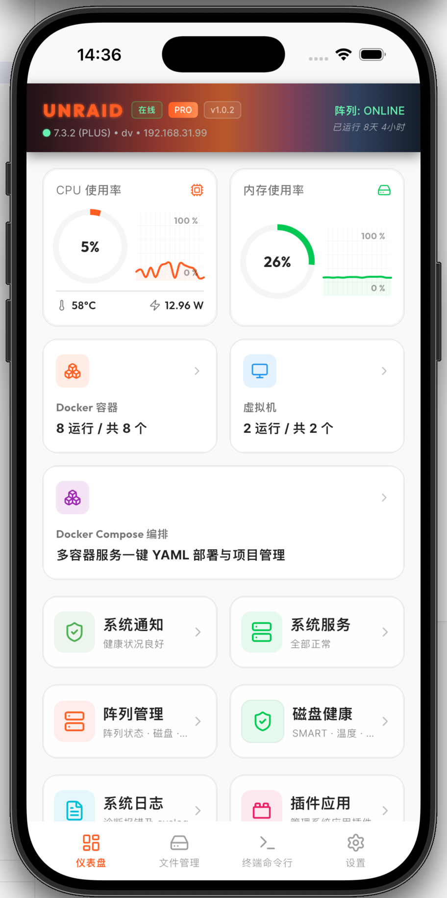
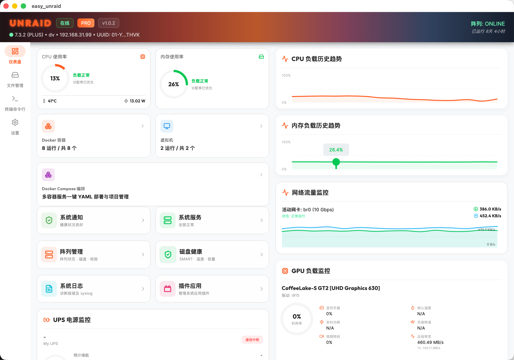
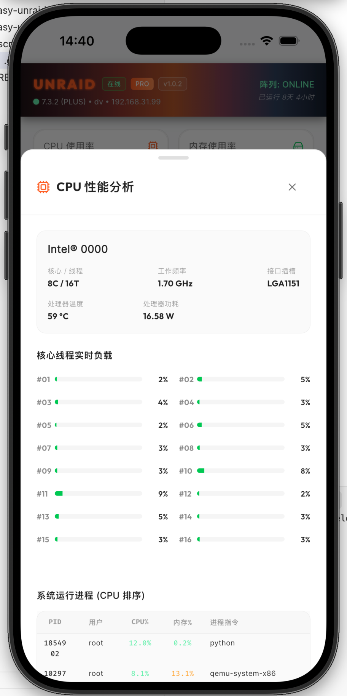
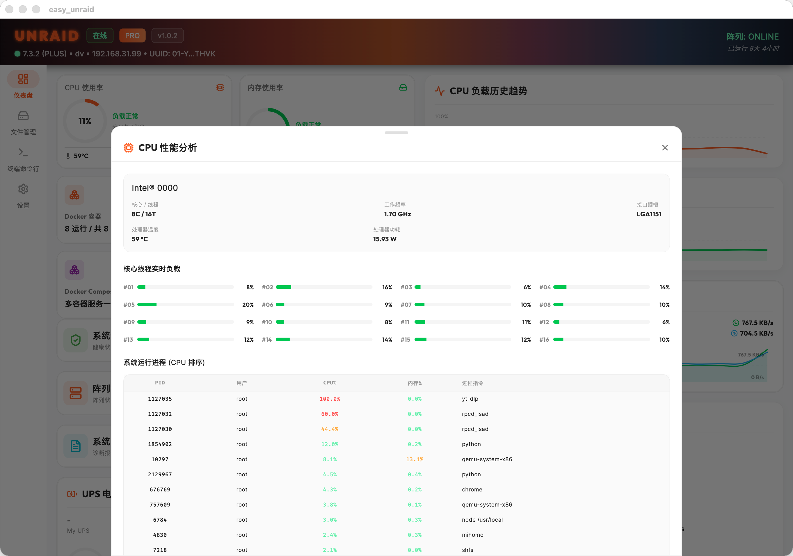
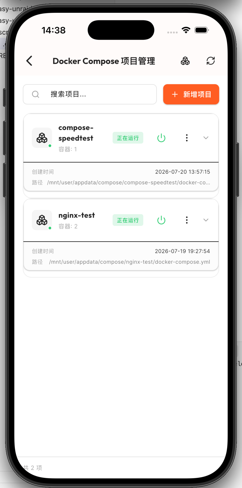
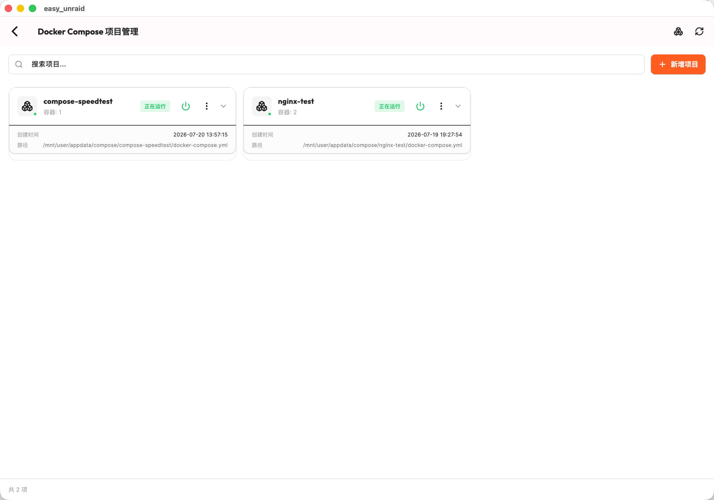
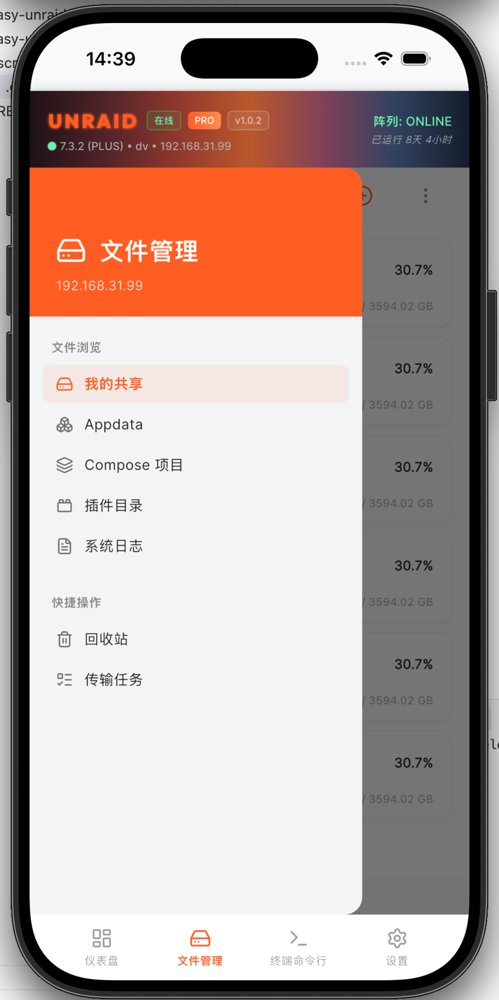
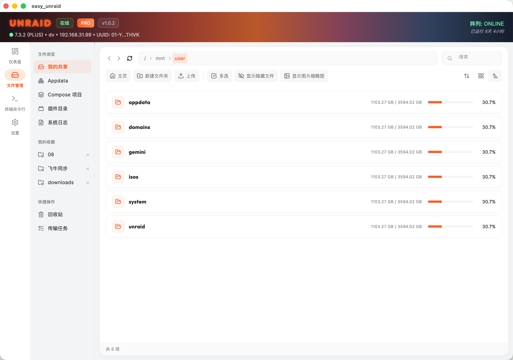

# 🚀 Easy Unraid

  

  <strong>一款简洁、优雅且安全的跨平台 Unraid 服务器管理器</strong>

  
  
  
  

---

## 📌 目录 (Table of Contents)

<b>📖 点击展开/折叠目录大纲 (Click to Toggle)</b>

*   **[🇨🇳 中文介绍](#-中文介绍)**
    *   [✨ 核心功能亮点](#-核心功能亮点)
    *   [🚀 快速配对指南](#-快速配对指南-quick-start)
    *   [💎 免费版与专业版说明](#-免费版与专业版说明-free-vs-pro)
    *   [📥 客户端下载通道](#-客户端下载通道)
    *   [🛡️ 安全背书与极客审计](#-安全背书与极客审计)
*   **[🇺🇸 English Introduction](#-english)**
    *   [✨ Key Features](#-key-features)
    *   [🚀 Quick Start Guide](#-quick-start-guide)
    *   [💎 Free vs Pro Edition](#-free-vs-pro-edition)
    *   [📥 Downloads](#-downloads)
    *   [🛡️ Security & Privacy](#-security--privacy)

---

## 🇨🇳 中文介绍

**Easy Unraid** 是一款专为 Unraid 系统量身打造的跨平台客户端管理器。我们致力于打破传统的浏览器 WebUI 限制，为您在手机和电脑端提供流畅的原生交互、精美的可视化监控看板与深度系统管理服务。

### ✨ 核心功能亮点

#### 📊 实时硬件仪表盘
直观图形化展示 CPU 负载、各核心实时温度、内存使用率、实时网速及磁盘阵列读写流量，服务器状态一手掌控。

  
  &nbsp;&nbsp;&nbsp;&nbsp;
  

  
  &nbsp;&nbsp;&nbsp;&nbsp;
  

---

#### 🐳 Docker 与 Compose 编排
一键启停/重启 Docker 容器，实时流式查阅日志；**独家提供对 Docker Compose 项目一键部署与 YAML 语法高亮编辑的支持**，享受丝滑的项目编排。

  
  &nbsp;&nbsp;&nbsp;&nbsp;
  

---

#### 💾 存储阵列深度监控
精美图表化展示磁盘空间使用率，实时读取各个硬盘的读写速度、工作温度以及健康坏道（Errors）警报。

---

#### 📁 极速文件管理器
基于高安全性 SFTP 协议实现。**内置本地 HTTP 媒体流串流服务器，支持 4K 高清电影/无损音乐免下载极速在线播放**；支持 PDF 高清预览、ZIP 等压缩包在线目录树浏览与一键秒级解压。

  
  &nbsp;&nbsp;&nbsp;&nbsp;
  

---

#### 🗑️ 误删回收站双重保护
App 内置独立物理回收站缓冲机制，手机上误删的文件可暂存并一键原路还原，彻底杜绝宝贵数据意外被抹除。

---

#### 🚀 虚拟机与全功能 SSH 终端
支持管理虚拟机服务的启停；内置多会话高安全 SSH 终端控制台，让您随时随地进行深度服务器维护。

---

### 🚀 快速配对指南 (Quick Start)

首次运行 App 时，在系统配置页需要进行 SSH 配对。我们为您提供了两种极具弹性与安全性的连接模式：

#### 方式 A：自动模式（极简一步配对）
1. 填入您的 Unraid API 链接及 SSH 端口。
2. 填入您的 `root` 账户密码。
3. App 连通后会自动生成高安全强度的 SSH 公私钥对并注入您的 Unraid 闪存中。配对完成后，**明文密码在内存中会被立即物理抹除，永久不在本地存储**。后续连接均走密钥对免密通信。

#### 方式 B：手动模式（推荐 - 100% 密码零接触）
1. 填入您的 Unraid API 链接及 SSH 端口。
2. 在 App 配置中生成或填入您已有的 SSH 密钥对，并复制 App 展现的 **公钥 (Public Key)**。
3. 登录您的 Unraid Web 管理页面，打开终端，将此公钥内容追加到您的 `/boot/config/ssh/authorized_keys` 授权文件中即可。
4. App 将不经过任何密码输入环节，直接通过您保存的私钥安全建立 SSH 会话，对您的密码安全做到 100% 零触碰。

---

### 💎 免费版与专业版说明 (Free vs Pro)

Easy Unraid 采用“基础核心功能永久免费，高级生产力工具付费激活”的良性开发模式，以保障项目的长期维护与迭代。

| 功能模块 | 免费版 (Free) | 专业版 (Pro) |
| :--- | :---: | :---: |
| **📊 实时硬件仪表盘** (CPU/内存/网速实时折线看板) | **✅ 免费** | **✅ 免费** |
| **💾 存储阵列监控** (磁盘空间/温度/Errors坏道警告) | **✅ 免费** | **✅ 免费** |
| **⚙️ 基础系统配置** (多服务器/SSH免密自动与手动模式) | **✅ 免费** | **✅ 免费** |
| **📁 极速文件管理器** (SFTP文件管理/在线 4K 媒体串流/PDF/解压) | ❌ 需激活 | **✅ 解锁** |
| **🗑️ 误删回收站保护** (App层物理回收站防灾缓冲) | ❌ 需激活 | **✅ 解锁** |
| **🐳 Docker 容器与 Compose 编排** (启停/日志/YAML高亮编辑/一键部署) | ❌ 需激活 | **✅ 解锁** |
| **🚀 虚拟机控制与 SSH 会话终端** (VM开关/全功能终端) | ❌ 需激活 | **✅ 解锁** |

> [!NOTE]
> 授权购买激活方式请在 App 内的 **「设置 ➔ 解锁专业版」** 中查看。

> [!TIP]
> **💡 良心授权政策：一次激活，全家共享，不限设备**  
> 专业版授权**与您的 Unraid 服务器引导 U 盘唯一硬件 GUID 强绑定**。一旦服务器成功激活，您所有连入该服务器的手机、平板、Mac 或 Windows 电脑等客户端**均会自动解锁并免费畅享全部 PRO 版专业功能**，无需重复付费。

---

### 📥 客户端下载通道

请前往 **[👉 最新发布页面 (Releases)](https://github.com/wlaosj/easy-unraid-releases/releases/latest)** 下载对应系统的安装包：

| 平台 | 格式 | 安装与使用说明 |
| :--- | :---: | :--- |
| **🤖 安卓端 (Android)** | `.apk` | 推荐下载 `arm64-v8a` 版本以获得最佳硬件加速性能。 |
| **💻 苹果端 (macOS)** | `.dmg` | 下载后双击打开，将 `Easy Unraid` 拖入 `Applications` 文件夹即可。 |
| **🔌 微软端 (Windows)** | `.zip` | 下载后解压，双击运行文件夹内的 `easy_unraid.exe` 即可（免安装）。 |
| **📱 苹果手机端 (iOS)** | `App Store` | 正在 App Store 上架审核中，敬请期待。 |

---

### 🛡️ 安全背书与极客审计

服务器的安全关乎您的数字资产生命。我们始终坚持“本地直连、安全透明”的极客开发原则：

> [!IMPORTANT]
> **1. 密码零保留，物理层抹除**  
> 无论何种模式，App 均不以任何明文形式在本地保留您的 root 密码。配对成功后即走高安全的 RSA/ED25519 强加密 SSH 密钥对进行免密连接。

> [!TIP]
> **2. 核心通信组件 100% 开源审计**  
> 所有涉及密钥对生成、密码配对与底层命令执行逻辑，均封装在我们的独立开源模块中，接受全球极客的安全性审计。  
> 🔗 开源模块地址：[easy-unraid-ssh 源码库](https://github.com/wlaosj/easy-unraid-ssh)

> [!NOTE]
> **3. 纯本地直接连接，绝无云端中转**  
> App 仅与您填写的服务器 IP（局域网直连或您自己的内网穿透域名）直接通信，绝无云端中转服务器，也绝不收集任何流量日志。欢迎使用 `Charles`、`Wireshark` 等代理抓包工具随时进行网络流量审计。

---

## 🇺🇸 English

**Easy Unraid** is a sleek, modern, and powerful cross-platform manager for Unraid servers, built with Flutter. It breaks free from traditional browser limitations to provide you with a fluid, native experience on both mobile devices and desktops.

### ✨ Key Features

#### 📊 Real-time Dashboard
Beautiful interactive charts displaying CPU load, individual core temperatures, memory usage, network bandwidth, and array read/write throughput.

  
  &nbsp;&nbsp;&nbsp;&nbsp;
  

  
  &nbsp;&nbsp;&nbsp;&nbsp;
  

---

#### 🐳 Docker & Compose Orchestration
Start, stop, and restart Docker containers and view live stream logs. **Exclusive support for Docker Compose project deployments and YAML editor** on both mobile and desktop.

  
  &nbsp;&nbsp;&nbsp;&nbsp;
  

---

#### 💾 Storage Array Monitor
Track disk utilization, read/write speeds, temperatures, and smart health errors in real-time.

---

#### 📁 Powerful File Manager
Full-featured SFTP file browser. **Built-in local HTTP streaming server enabling seekable 4K video & audio playback**; PDF viewer and online ZIP / TAR archive tree browser/extraction.

  
  &nbsp;&nbsp;&nbsp;&nbsp;
  

---

#### 🗑️ Safe Trash Bin
Integrated recycle bin support for file deletes. Easily restore files/folders to avoid accidental data loss.

---

#### 🚀 VM Control & SSH Console
Start, stop, or restart your Unraid virtual machines; built-in multi-session SSH console for advanced server maintenance.

---

### 🚀 Quick Start Guide

During the initial setup, you will need to establish an SSH pairing. Easy Unraid provides two secure configuration modes:

#### Mode A: Automatic Pairing
1. Fill in your Unraid API URL and SSH port.
2. Input your `root` password.
3. The App will connect, generate a secure SSH keypair, and inject the public key into your Unraid flash drive automatically. Once verified, **your password is wiped from memory immediately and never saved locally**.

#### Mode B: Manual Setup (Recommended - 100% Password-free)
1. Fill in your Unraid API URL and SSH port.
2. Generate an SSH keypair in the App settings and copy the **Public Key**.
3. Log in to your Unraid WebGUI, open a terminal, and append the public key to your `/boot/config/ssh/authorized_keys` file.
4. The App will establish secure SSH connections using the saved private key without ever prompting for or touching your root password.

---

### 💎 Free vs Pro Edition

Easy Unraid adopts a sustainable model: "Essential monitoring features are permanently free, while advanced productivity tools require a Pro activation" to support continuous development.

| Feature | Free Edition | Pro Edition |
| :--- | :---: | :---: |
| **📊 Real-time Dashboard** (CPU/RAM/Network real-time stats) | **✅ Free** | **✅ Free** |
| **💾 Array Monitor** (Disk utilization/temperatures/smart errors) | **✅ Free** | **✅ Free** |
| **⚙️ Server Configurations** (Multi-server/SSH key pairing) | **✅ Free** | **✅ Free** |
| **📁 File Manager** (SFTP browsing/4K stream server/PDF/unzip) | ❌ Pro Only | **✅ Unlocked** |
| **🗑️ Safe Recycle Bin** (App-level delete protection) | ❌ Pro Only | **✅ Unlocked** |
| **🐳 Docker & Compose** (Logs/YAML editor/deployments) | ❌ Pro Only | **✅ Unlocked** |
| **🚀 VM & SSH Console** (Virtual machines/multi-session terminal) | ❌ Pro Only | **✅ Unlocked** |

> [!NOTE]
> License activation options and detailed pricing are available in the App under **"Settings ➔ Unlock Pro"**.

> [!TIP]
> **💡 Sustainable Licensing Policy: One-Time Server Activation, Unlimited Clients**  
> The Pro license is **directly bound to your Unraid server's unique Flash Drive GUID**. Once your server is activated, all client devices (phones, tablets, Mac, or Windows PCs) connecting to this server **will automatically unlock and enjoy all PRO features** without any device limit or extra charges.

---

### 📥 Downloads

Please visit the **[👉 Releases Page](https://github.com/wlaosj/easy-unraid-releases/releases/latest)** to download the installation package:

*   **Android (`.apk`)**: Select the architecture match for your device (typically `arm64-v8a` is recommended).
*   **macOS (`.dmg`)**: Download, double click, and drag `Easy Unraid` into your `Applications` folder.
*   **Windows (`.zip`)**: Download, extract the archive, and double-click `easy_unraid.exe` to run.

---

### 🛡️ Security & Privacy

Your server's root access is critical. We designed Easy Unraid with a security-first architecture:

*   **Zero Password Storage & Manual Passwordless Access**:
    *   **Automatic Mode**: The root password is only used in memory for the initial session to inject the SSH key, then permanently wiped.
    *   **Manual Mode (Recommended)**: You **never need to input your root password in the App**. The App can generate an SSH keypair for you locally; simply copy the public key and manually append it to your Unraid's `authorized_keys` file to complete the setup.
    *   All subsequent sessions rely entirely on high-strength SSH keypair authentication.
*   **Open-Source & Auditable**: The core SSH connector, keygen, and key injection logic are completely open-source. Inspect the code here: [easy-unraid-ssh Repository](https://github.com/wlaosj/easy-unraid-ssh).
*   **100% Direct Connection**: No telemetry, no backend servers, and no data forwarding. The client communicates directly with your server IP. Feel free to monitor the network traffic using any proxy tool.
