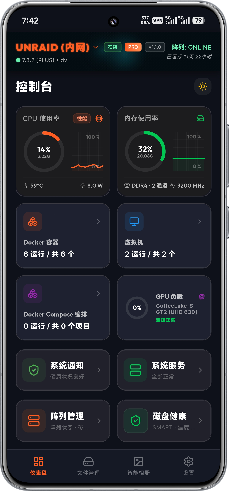
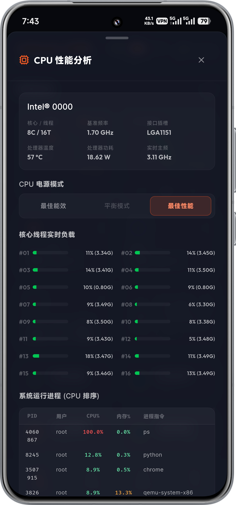
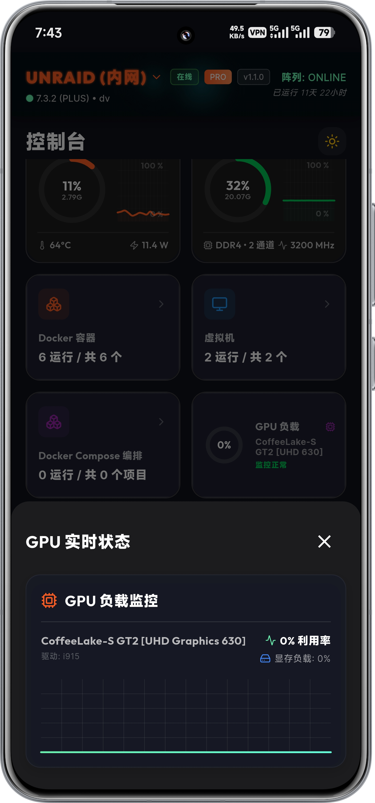
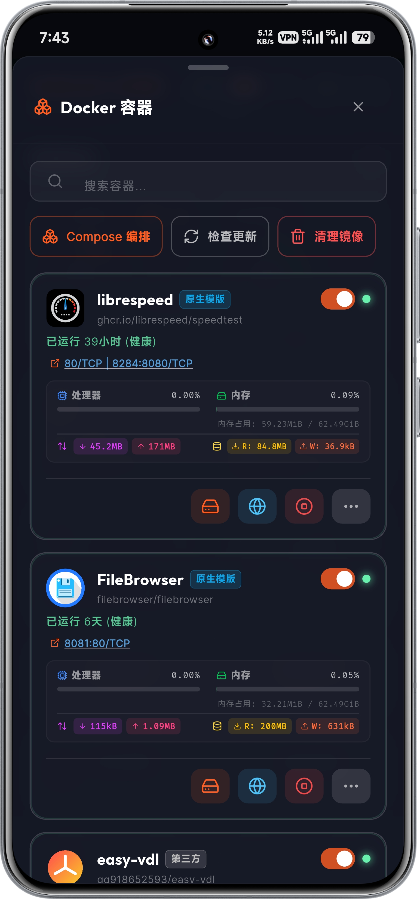
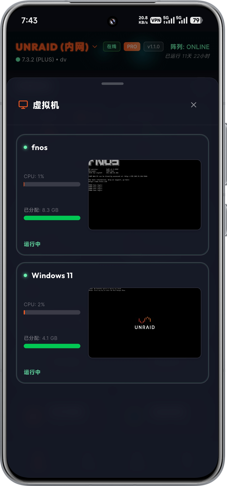
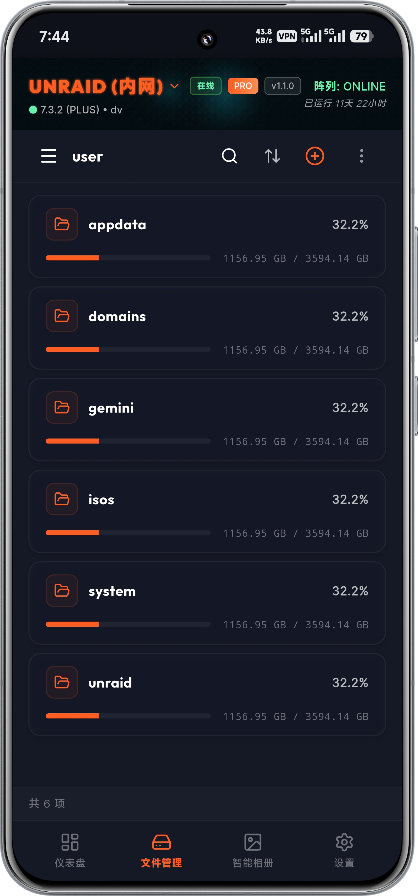
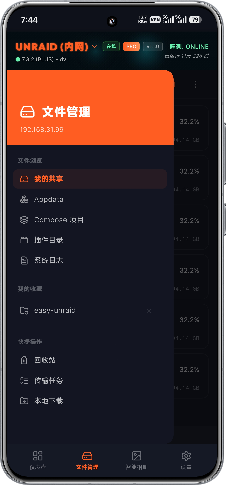
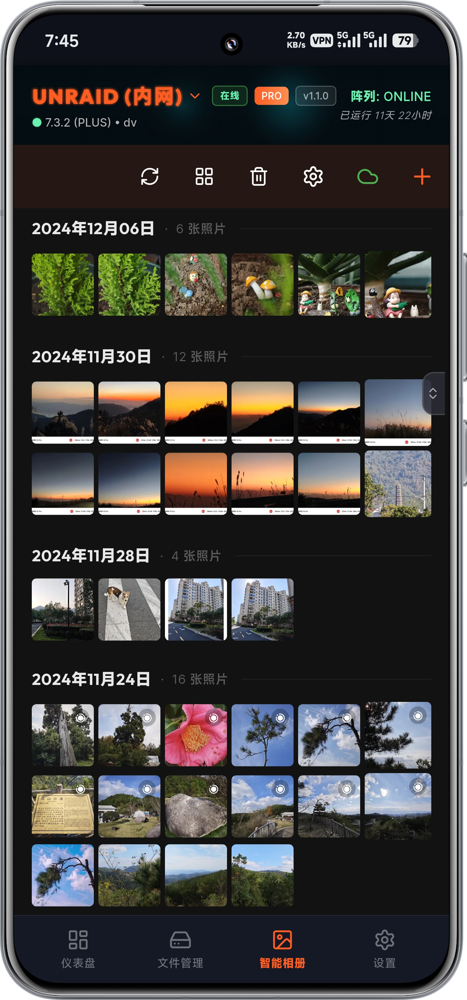

# 🚀 Easy Unraid

  

  <strong>一款简洁、优雅且安全的跨平台 Unraid 服务器管理器</strong>

  
  
  
  
  

---

## 📌 目录 (Table of Contents)

<b>📖 点击展开/折叠目录大纲 (Click to Toggle)</b>

*   **[🇨🇳 中文介绍](#intro-zh)**
    *   [✨ 核心功能亮点](#features-zh)
    *   [🚀 快速配对指南](#quick-start-zh)
    *   [🌐 外网安全访问建议](#remote-zh)
    *   [💎 免费版与专业版说明](#free-vs-pro-zh)
    *   [📥 客户端下载通道](#downloads-zh)
    *   [🛡️ 安全背书与极客审计](#security-zh)
*   **[🇺🇸 English Introduction](#intro-en)**
    *   [✨ Key Features](#features-en)
    *   [🚀 Quick Start Guide](#quick-start-en)
    *   [🌐 Remote Access & Security](#remote-en)
    *   [💎 Free vs Pro Edition](#free-vs-pro-en)
    *   [📥 Downloads](#downloads-en)
    *   [🛡️ Security & Privacy](#security-en)
*   **[📸 运行截图 (Screenshots)](#screenshots)**

---

## 🇨🇳 中文介绍

**Easy Unraid** 是一款基于 Flutter 构建的高性能、跨平台 Unraid 服务器管理客户端。突破传统浏览器访问限制，为移动设备与桌面端提供流畅、原生的硬件监控、容器管理与文件传输体验。

### ✨ 核心功能亮点

- **📊 实时硬件监测**
  - **炫酷视觉**：采用跑车发光表盘与苹果运动圆环重绘 CPU 和内存监测。
  - **主题切换**：支持仪表盘顶部一键无感切换深浅色主题。
  - **垂直对齐**：多维度图表时间轴垂直对齐，跨指标走势一目了然。
- **🐳 自托管智能相册 (PRO)**
  - **自研后端**：一键部署轻量级自托管 Docker 容器（`easy-unraid-photos`）。
  - **流畅动效**：支持 Pinch 双指网格捏合缩放、大图视差滑屏与 Hero 飞入，高刷 120Hz 极速贴手。
  - **智能加速**：局域网自动探活直连（LAN Bypass），外网自动回退安全加密 SSH 隧道。
  - **安全隔离**：不同服务器的数据通过 Isar 数据库在沙盒中物理隔离。
- **🔒 安全隧道穿透与 WebUI 路由**
  - **零暴露**：外网远程时后台自动建立安全 SSH 本地端口转发。
  - **防断连**：内置专属 WebView 管理页，无公网暴露，安全稳固。
- **🛡️ 密钥防护与日志安全审计**
  - **安全加固**：一键禁用 Unraid 宿主机 SSH 密码登录，强制密钥验证防爆破。
  - **图形审计**：实时解析系统日志，以图形化报表审计 WebUI 与 SSH 会话活动。
- **🐳 Docker & Compose 编排**
  - **状态控制**：一键执行容器启动/停止/重启，提供新版本升级提示。
  - **一键更新**：独家支持点击角标一键重建并自动拉起更新容器。
  - **极客编排**：独家支持 Docker Compose 项目一键部署与 YAML 语法高亮编辑 (PRO)。
  - **直观监控**：集成容器 CPU/内存进度条与 Network/Disk IO 彩色流量胶囊。
- **💾 3D 拟物化阵列前面板**
  - **拟物机箱**：仿真复刻 NAS 物理硬盘托架前面板，绿色 LAN 网灯高频闪烁。
  - **硬盘体检**：实时监测硬盘读写速度、工作温度、休眠状态及坏道 Errors 警告。
  - **三态判定**：SMART 状态重构为健康/未知/异常，自动过滤无 SMART 引导/虚拟盘。
- **📁 极速文件管理器与分享转存**
  - **断点续传**：基于极速 SFTP，大文件上传与下载支持暂停、继续和断线后自动重连续传。
  - **桌面拖拽**：macOS 独家支持直接向 App 窗口拖入文件/文件夹触发快速上传。
  - **秒开缓存**：内置 4K 媒体流播，针对 PDF 与图片引入专属本地磁盘缓存，二次打开秒开。
  - **分享转存**：iOS/Android 系统级分享扩展一键转存，智能记忆 4 条历史存储路径。
- **🗑️ 误删防灾回收站**
  - **防灾保护**：内置独立物理回收站缓冲机制，误删文件可快速一键原路还原。
- **🚀 虚拟机控制与内置 SSH 终端**
  - **VNC控制**：支持虚拟机状态一键启停并内置 VNC 远程桌面控制台。
  - **终端卡片**：SSH 终端深度融入仪表盘快捷卡片，支持右键/长按菜单、剪贴板快捷粘贴（Cmd/Ctrl+V）。
  - **安全交互**：优化二次 PIN 码验证，进入终端时不触发输入框聚焦，防止与指纹面容弹窗冲突。
- **🔋 UPS 备用电源监测**
  - **NUT适配**：全量适配第三方 NUT 插件（`nut-dw`），展示 UPS 实际功耗瓦数与预计续航。
  - **趋势折线**：新增 UPS 功耗历史趋势折线图，主界面解耦加载。
- **🎨 桌面集成与个性化定制**
  - **原生组件**：支持 iOS/Android 三端原生桌面小组件，基于 App Group 共享沙盒实时数据同步。
  - **个性定制**：支持自定义顶部标题栏渐变预设及本地壁纸背景，提供 macOS 状态栏托盘监控。
  - **静默更新**：macOS 平台一键检测并静默自动完成解包、替换与新版自动重新拉起。

(<a href="#readme-top">⬆️ 返回顶部 / Back to Top</a>)

---

### 🚀 快速配对指南 (Quick Start)

首次运行 App 时，在系统配置页需要完成**连接模式配置**与**安全 SSH 密钥配对**：

#### 第一步：选择连接模式 (Connection Mode)
- **🌐 直连模式 (Direct Connection)**：推荐在【局域网内网】或【已连接 VPN（WireGuard, Tailscale, ZeroTier）】时使用，延迟最低、速度最快。
- **🔒 SSH 隧道穿透 (SSH Tunneling)**：推荐在【外网远程访问】且未开启 VPN 时使用。只需在路由器映射 SSH 端口，App 即可自动通过加密通道穿透 API 数据，实现 API 端口零暴露。

#### 第二步：进行安全 SSH 密钥配对 (SSH Pairing)
App 不在本地存储明文 root 密码。配对成功后统一走 RSA/ED25519 强加密 SSH 密钥对进行免密连接：
- **方式 A：自动模式（极简一步配对）**
  1. 输入主机地址、端口及 `root` 账户密码。
  2. App 连通后自动生成 SSH 密钥对并写入服务器闪存，配对成功后**明文密码在内存中被物理抹除**。
- **方式 B：手动模式（推荐 - 100% 密码零接触）**
  1. 输入主机地址及端口。
  2. 在 App 配置中生成或导入 SSH 密钥对，复制显示出的 **公钥 (Public Key)**。
  3. 登录 Unraid Web 管理页打开终端，将公钥内容追加到 `/boot/config/ssh/authorized_keys` 即可免密连接。

(<a href="#readme-top">⬆️ 返回顶部 / Back to Top</a>)

---

### 🌐 外网安全访问建议 (Remote Access)

为了服务器安全，在外网远程连接时**强烈建议使用 VPN 虚拟局域网隧道（如 WireGuard、Tailscale 或 ZeroTier）**，而非在路由器上直接暴露 API 与 SSH 端口。

> [!WARNING]
> **风险提示**：Easy Unraid 需要同时与 Unraid API（HTTP/HTTPS 端口）及 SSH 控制台（22 端口）建立连接。直接将管理端口映射到公网极易遭受暴力破解和扫描攻击。

> [!TIP]
> **VPN 隧道优势**：
> * **极致安全**：公网零暴露，核心端口安全隐蔽。
> * **配置一致**：接入局域网后，App 统一填写 Unraid **局域网内网 IP**（如 `192.168.31.99`）即可连接，无需为 API/SSH 单独设置公网端口。
> * **开箱即用**：Unraid 官方内置 WireGuard 支持；应用市场亦提供 Tailscale 和 ZeroTier 一键异地组网方案。

(<a href="#readme-top">⬆️ 返回顶部 / Back to Top</a>)

---

### 💎 免费版与专业版说明 (Free vs Pro)

Easy Unraid 采用“基础核心功能永久免费，高级生产力工具付费激活”的模式，以保障项目的长期维护与迭代。

| 功能模块 | 免费版 (Free) | 专业版 (Pro) |
| :--- | :---: | :---: |
| **📊 实时硬件仪表盘** (CPU/内存/网速看板) | **✅ 免费** | **✅ 免费** |
| **💾 存储阵列监控** (磁盘空间/温度/坏道警告) | **✅ 免费** | **✅ 免费** |
| **⚙️ 基础系统配置** (多服务器配置/自动切换) | **✅ 免费** | **✅ 免费** |
| **🔒 SSH 隧道与安全双模连接** (直连/加密隧道) | **✅ 免费** | **✅ 免费** |
| **🛡️ 登录安全审计** (会话日志解析与图形化统计) | **✅ 免费** | **✅ 免费** |
| **🐳 智能相册** (自托管 Docker 后端/大图视差/Pinch缩放/备份同步) | ❌ 需激活 | **✅ 解锁** |
| **📁 极速文件管理器** (SFTP/4K 串流/压缩包解解压/全局搜索) | ❌ 需激活 | **✅ 解锁** |
| **🗑️ 误删回收站保护** (物理回收站防灾缓冲) | ❌ 需激活 | **✅ 解锁** |
| **🐳 Docker 容器与 Compose 编排** (日志/YAML 高亮/部署) | ❌ 需激活 | **✅ 解锁** |
| **🚀 虚拟机控制与 SSH 终端** (VM 控制/全功能终端/禁用密码登录) | ❌ 需激活 | **✅ 解锁** |

> [!TIP]
> **💡 授权政策：一次激活，全家共享，不限设备**  
> 专业版授权与 Unraid 服务器引导 U 盘唯一硬件 GUID 绑定（单授权最多可同时绑定 3 台服务器）。服务器激活后，所有连接该服务器的客户端设备（手机/平板/Mac/Windows）**均会自动解锁全部 PRO 专业功能**。购买与激活入口在 App 内 **「设置 ➔ 解锁专业版」**。

(<a href="#readme-top">⬆️ 返回顶部 / Back to Top</a>)

---

### 📥 客户端下载通道

请前往 **[👉 最新发布页面 (Releases)](https://github.com/wlaosj/easy-unraid-releases/releases/latest)** 下载对应系统的安装包：

| 平台 | 格式 | 安装与使用说明 |
| :--- | :---: | :--- |
| **🤖 安卓端 (Android)** | `.apk` | 推荐下载 `arm64-v8a` 版本以获得最佳硬件加速性能。 |
| **💻 苹果端 (macOS)** | `.dmg` | 下载后双击打开，将 `Easy Unraid` 拖入 `Applications` 文件夹。 |
| **🔌 微软端 (Windows)** | `.zip` | 下载后解压，双击运行文件夹内的 `easy_unraid.exe`（免安装）。 |
| **📱 苹果手机端 (iOS)** | `TestFlight` | 🟢 **已开启公测！** 目前正处于苹果官方初审阶段，审核通过后将公布万能链接；亦可将 Apple ID 邮箱发给我们获取内测邀请。 |
| **🇨🇳 鸿蒙端 (HarmonyOS)** | `HAP / APP` | 纯血鸿蒙 (NEXT) 本地全链路已验证跑通。目前正处于技术适配阶段，等待官方发布支持 Dart 3.0+ 的 SDK。（注：HarmonyOS 4.x 及以下用户可直接下载运行 Android 64位安装包） |

---

### 💬 官方 Telegram 社区与交流群

欢迎加入官方 Telegram 交流群，参与功能讨论、BUG 提交与最新公测版体验：  
👉 **[点击加入 Easy Unraid 官方 Telegram 交流群](https://t.me/+7jcTMePlNVwwZjg1)**

---

### 🛡️ 安全背书与极客审计

服务器的安全关乎您的数字资产生命。我们始终坚持“本地直连、安全透明”的极客开发原则：

- **密码零保留，物理层抹除**：App 不在本地保留明文 root 密码。配对成功后统一使用高安全性的 RSA/ED25519 强加密 SSH 密钥对进行免密连接。
- **核心通信组件 100% 开源审计**：所有涉及密钥对生成、密码配对与底层命令执行逻辑，均封装在我们的独立开源模块中，接受全球极客安全性审计：[easy-unraid-ssh 源码库](https://github.com/wlaosj/easy-unraid-ssh)。
- **纯本地直接连接，绝无云端中转**：App 仅与您填写的服务器 IP 直接通信，绝无云端中转服务器，也绝不收集流量日志。欢迎使用抓包工具进行审计。
- **敏感数据本地加解密与存储机制**：
  - **Android**：通过 Android Keystore 系统级硬件安全密钥库加密保护。
  - **iOS**：使用系统级安全钥匙串（Keychain）进行沙盒加密隔离存储。
  - **macOS (独立分发版)**：采用 App 独立隔离沙盒（SharedPreferences Sandbox）加密存储，防跨目录访问；未来商店版将支持 Keychain。
  - **Windows**：使用 Windows Credential & Registry 隔离沙盒物理存储。

(<a href="#readme-top">⬆️ 返回顶部 / Back to Top</a>)

---

## 🇺🇸 English

**Easy Unraid** is a sleek, modern, and powerful cross-platform manager for Unraid servers, built with Flutter. It breaks free from traditional browser limitations to provide you with a fluid, native experience on mobile devices and desktops.

### ✨ Key Features

- **📊 Real-time Dashboard**
  - **Activity Rings**: Redesigned CPU and RAM monitors to Cupertino Activity Rings and high-end Speedometers.
  - **Theme Toggle**: Switch between Light and Dark mode seamlessly at the top bar.
  - **Synchronized Axis**: Vertically synchronized time-axes across multiple telemetry metrics.
- **🐳 Self-Hosted Smart Gallery (PRO)**
  - **Lightweight Backend**: One-click deployment of custom Docker backend (`easy-unraid-photos`) with GPU hardware acceleration.
  - **Smooth Transitions**: Pinch-to-zoom timeline grids, parallax scrolling, Apple-style Hero transitions, and 120Hz smooth scrolling.
  - **LAN Bypass**: Bypasses SSH tunnel on local networks (LAN auto-probe) to maximize transfer speeds, falling back to secure tunnel on external WAN.
  - **Sandbox Isolation**: Secures your libraries via isolated multi-server local Isar databases.
- **🔒 Secure Tunneling & WebUI Routing**
  - **Port Forwarding**: Automatic local SSH tunnel forwarding for secure remote administration.
  - **In-App WebView**: Direct secure WebUI console routing with focus-loss protection.
- **🛡️ Key-Based Security & Logs Auditing**
  - **SSH Hardening**: One-click disabling of Unraid SSH password logins, forcing secure key-only connections.
  - **Security Audits**: Real-time parsing and graphical auditing of SSH/WebUI sessions.
- **🐳 Docker & Compose Orchestration**
  - **State Control**: Seamless container start/stop/restarts with update flags.
  - **One-Click Updates**: Rebuild and update container binaries directly from card triggers.
  - **Compose Editor**: Deploy Docker Compose projects with built-in YAML syntax highlight editor (PRO).
  - **Visual Statistics**: Dedicated CPU/RAM progress bars and colored IO traffic capsules.
- **💾 3D Skeuomorphic Array Panel**
  - **NAS Chassis Bezel**: Simulates a physical rackmount bezel with green flickering LAN lights.
  - **Smart Warnings**: Real-time read/write speeds, temps, standby states, and bad sector warnings.
  - **Three-State Telemetry**: SMART diagnostics (Healthy/Unknown/Warning) while auto-omitting boot/virtual disks.
- **📁 Advanced File Manager & Share Extension**
  - **Resumable Transfers**: SFTP upload/downloads with pause, resume, and auto-resuming on network drop.
  - **macOS Drag & Drop**: Native drag-and-drop file/folder transfers straight into the application window.
  - **Instant Preview**: Built-in 4K video streaming and dedicated disk caches for instant PDF/image reopening.
  - **Native Share Sheet**: iOS/Android system shares to Unraid with 4 recent path memories and App Group sandbox support.
- **🗑️ Safe Recycle Bin**
  - **Delete Protection**: In-app physical recycle bin buffer with one-click recovery.
- **🚀 VM Power Control & SSH Terminal**
  - **VM Management**: Control VM states with built-in in-app VNC console support.
  - **Embedded Terminal**: Integrated SSH terminal card with right-click context menus and `Cmd+V` / `Ctrl+V` pasting.
  - **Verification Polish**: Autofocus-free PIN screen preventing clashes with system biometric prompt.
- **🔋 UPS Telemetry Integration**
  - **NUT Plugin**: Full integration for NUT plugin (`nut-dw`), presenting live wattage and estimated runtime.
  - **Power Sparklines**: Decoupled background telemetry loading with historical power trend line charts.
- **🎨 Customization & Widgets**
  - **Home Screen Widgets**: Native iOS/Android/macOS widgets synced via App Group sandbox.
  - **Tray Utility**: macOS menu bar tray utility with customizable gradient and background headers.
  - **Silent Updater**: MacOS background auto-extraction, replacing, and relaunching of binary updates.

(<a href="#readme-top">⬆️ 返回顶部 / Back to Top</a>)

---

### 🚀 Quick Start Guide

During initial setup, configure the **Connection Mode** and establish an **SSH Pairing**:

#### Step 1: Choose Connection Mode
- **🌐 Direct Connection**: Recommended for [LAN Internal] or [VPN Connected (WireGuard, Tailscale, ZeroTier)] networks for lowest latency and best performance.
- **🔒 SSH Tunneling**: Recommended for [External Remote Access] without a VPN. By forwarding your Unraid SSH port on the router, the App automatically tunnels API traffic over SSH, keeping API ports hidden.

#### Step 2: Establish Secure SSH Pairing
The App never stores your root password in plaintext. Subsequent connections use secure RSA/ED25519 keypairs:
- **Mode A: Automatic Pairing**
  1. Enter host address, port, and `root` password.
  2. The App connects, generates an SSH keypair, and injects the public key into your Unraid flash drive. Password is **wiped from memory immediately**.
- **Mode B: Manual Setup (Recommended - 100% Password-free)**
  1. Enter host address and port.
  2. Generate or import an SSH keypair in App settings and copy the **Public Key**.
  3. Log in to Unraid WebGUI, open terminal, and append the public key to `/boot/config/ssh/authorized_keys`.

(<a href="#readme-top">⬆️ 返回顶部 / Back to Top</a>)

---

### 🌐 Remote Access & Security Guide

To guarantee server safety, we **highly recommend using a VPN tunnel (such as WireGuard, Tailscale, or ZeroTier) for remote access**, rather than exposing API and SSH ports directly via port forwarding on your router.

> [!WARNING]
> **Security Notice**: Directly exposing core management ports (API and SSH port 22) to the public internet makes your server vulnerable to automated scanners and brute-force attacks.

> [!TIP]
> **VPN Tunnel Benefits**:
> * **Zero Public Exposure**: Keeps administration ports hidden behind encrypted gateways.
> * **Seamless Configuration**: Connect via your Unraid server's **local LAN IP** (e.g., `192.168.31.99`) in the App without configuring separate public ports.
> * **Built-in Options**: Unraid includes **built-in WireGuard support**, and community apps like **Tailscale** or **ZeroTier** can be deployed with one click.

(<a href="#readme-top">⬆️ 返回顶部 / Back to Top</a>)

---

### 💎 Free vs Pro Edition

Easy Unraid adopts a sustainable model: "Essential monitoring features are permanently free, while advanced productivity tools require a Pro activation".

| Feature | Free Edition | Pro Edition |
| :--- | :---: | :---: |
| **📊 Real-time Dashboard** (CPU/RAM/Network real-time stats) | **✅ Free** | **✅ Free** |
| **💾 Array Monitor** (Disk utilization/temperatures/smart errors) | **✅ Free** | **✅ Free** |
| **⚙️ Server Configurations** (Multi-server configuration & switching) | **✅ Free** | **✅ Free** |
| **🔒 SSH Tunneling** (Direct and secure local port forwarding) | **✅ Free** | **✅ Free** |
| **🛡️ Security Audit Logs** (Login session auditing and metrics) | **✅ Free** | **✅ Free** |
| **🐳 Smart Gallery** (Self-hosted Docker backend, pinch zoom, parallax scroll, backup sync) | ❌ Pro Only | **✅ Unlocked** |
| **📁 File Manager** (SFTP / 4K streaming / ZIP & TAR / Deep search) | ❌ Pro Only | **✅ Unlocked** |
| **🗑️ Safe Recycle Bin** (App-level delete protection) | ❌ Pro Only | **✅ Unlocked** |
| **🐳 Docker & Compose** (Logs/YAML editor/deployments) | ❌ Pro Only | **✅ Unlocked** |
| **🚀 VM & SSH Console** (Virtual machines/SSH terminal/Disable password auth) | ❌ Pro Only | **✅ Unlocked** |

> [!TIP]
> **💡 Sustainable Licensing Policy: One-Time Activation, Unlimited Clients**  
> The Pro license is directly bound to your Unraid server's unique Flash Drive GUID (supports up to 3 servers per license). Once activated, all client devices (phones, tablets, Mac, Windows) connecting to this server **automatically unlock all PRO features**. Activation is in the App under **"Settings ➔ Unlock Pro"**.

(<a href="#readme-top">⬆️ 返回顶部 / Back to Top</a>)

---

### 📥 Downloads

Visit the **[👉 Releases Page](https://github.com/wlaosj/easy-unraid-releases/releases/latest)** to download the installation package:

| Platform | Format | Installation & Usage Guide |
| :--- | :---: | :--- |
| **🤖 Android** | `.apk` | `arm64-v8a` is recommended for best hardware acceleration. |
| **💻 macOS** | `.dmg` | Double-click to open and drag `Easy Unraid` into your `Applications` folder. |
| **🔌 Windows** | `.zip` | Extract and double-click `easy_unraid.exe` to run (portable). |
| **📱 iOS** | `TestFlight` | 🟢 **Live on TestFlight!** Public link will be posted once Apple review completes. Email us your Apple ID for a direct invite. |
| **🇨🇳 HarmonyOS** | `HAP / APP` | HarmonyOS NEXT pipeline validated. Currently under adaptation for Dart 3.0+ SDK. (HarmonyOS 4.x users can download Android package directly) |

---

### 💬 Official Telegram Community & Support

Join our official Telegram community to chat with users and test preview builds:  
👉 **[Join Official Easy Unraid Telegram Group](https://t.me/+7jcTMePlNVwwZjg1)**

---

### 🛡️ Security & Privacy

* **Zero Password Storage**: Plaintext passwords are never saved. Connections rely on high-strength SSH keypair authentication.
* **Open-Source & Auditable**: Core SSH connector, keygen, and injection logic are open-source: [easy-unraid-ssh Repository](https://github.com/wlaosj/easy-unraid-ssh).
* **100% Direct Connection**: No telemetry, cloud servers, or data forwarding. Communicates directly with your server IP.
* **Sensitive Data Encryption**:
  * **Android**: Secured via hardware-backed Android Keystore.
  * **iOS**: Saved in secure System Keychain.
  * **macOS (Out-of-Store)**: Utilizes App Sandbox Local Encrypted Storage; transitions to System Keychain in App Store edition.
  * **Windows**: Encrypted within Windows Credential Manager & Registry.

(<a href="#readme-top">⬆️ 返回顶部 / Back to Top</a>)

---

## 📸 运行截图 (Screenshots)

### 📊 实时硬件仪表盘 (Dashboard)

  
  &nbsp;&nbsp;&nbsp;&nbsp;
  
  &nbsp;&nbsp;&nbsp;&nbsp;
  

### 🐳 Docker 容器管理 (Docker & Compose)

  
  &nbsp;&nbsp;&nbsp;&nbsp;
  

### 📁 极速文件管理器 (File Manager)

  
  &nbsp;&nbsp;&nbsp;&nbsp;
  

### 🐳 智能相册 (Smart Gallery)

  

(<a href="#readme-top">⬆️ 返回顶部 / Back to Top</a>)

