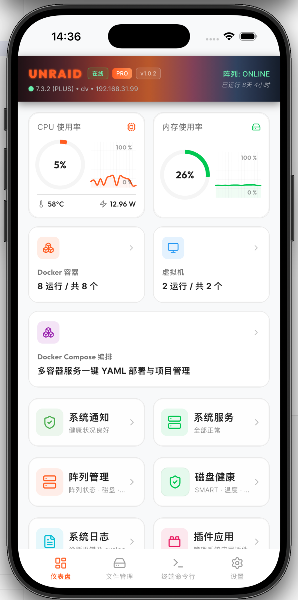
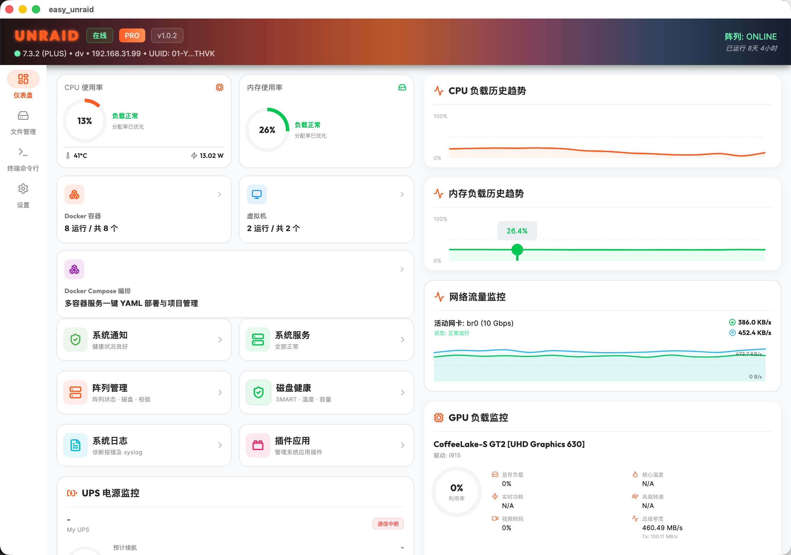
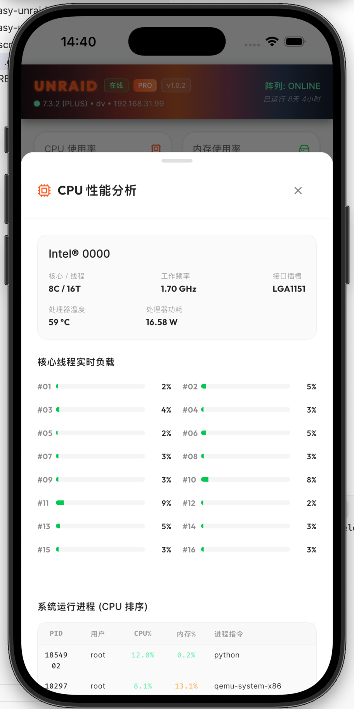
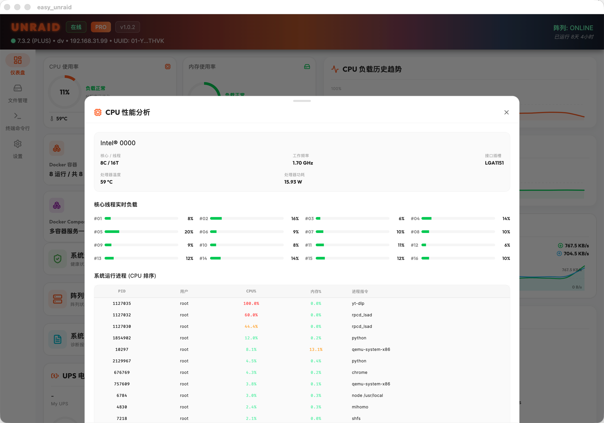
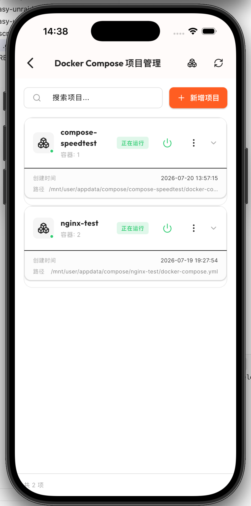
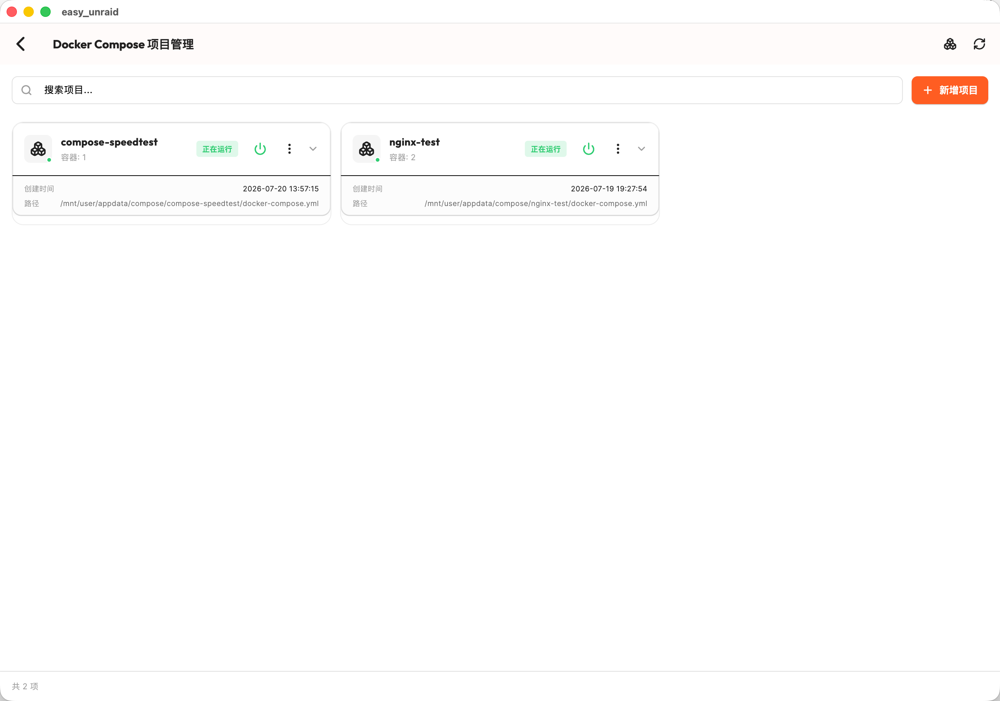
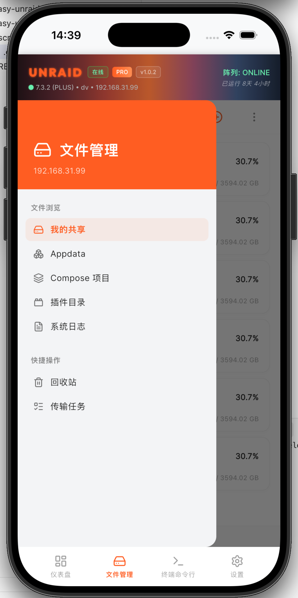
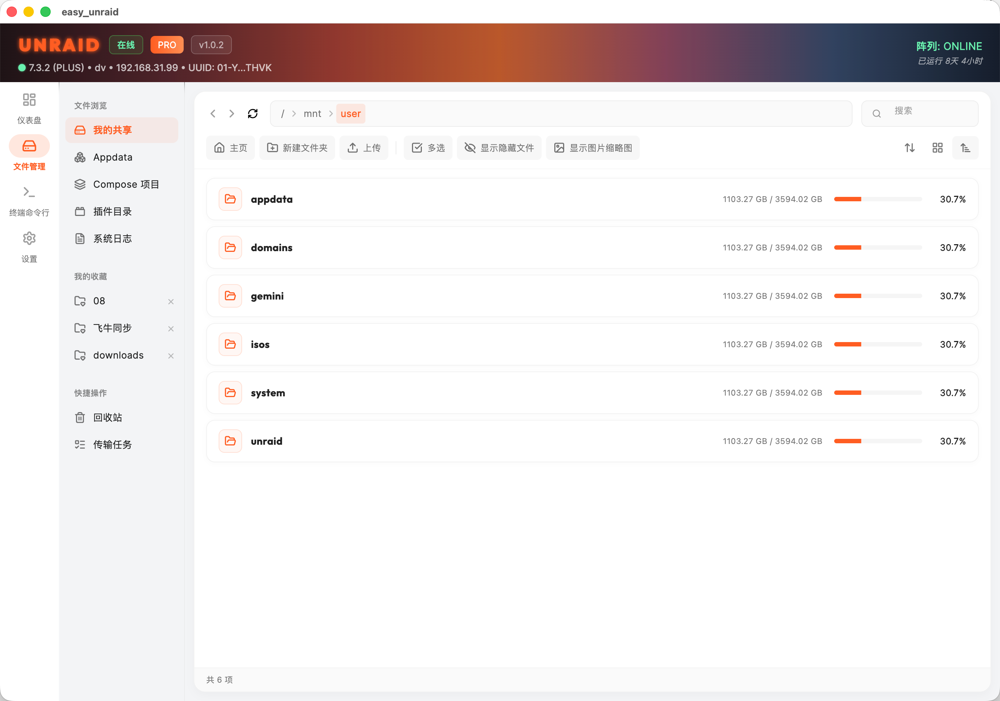

# 🚀 Easy Unraid

  

  <strong>一款简洁、优雅且安全的跨平台 Unraid 服务器管理器</strong>

  
  
  
  
  

---

## 📌 目录 (Table of Contents)

<b>📖 点击展开/折叠目录大纲 (Click to Toggle)</b>

*   **[🇨🇳 中文介绍](#intro-zh)**
    *   [✨ 核心功能亮点](#features-zh)
    *   [🚀 快速配对指南](#quick-start-zh)
    *   [🌐 外网安全访问建议](#remote-zh)
    *   [💎 免费版与专业版说明](#free-vs-pro-zh)
    *   [📥 客户端下载通道](#downloads-zh)
    *   [🛡️ 安全背书与极客审计](#security-zh)
*   **[🇺🇸 English Introduction](#intro-en)**
    *   [✨ Key Features](#features-en)
    *   [🚀 Quick Start Guide](#quick-start-en)
    *   [🌐 Remote Access & Security](#remote-en)
    *   [💎 Free vs Pro Edition](#free-vs-pro-en)
    *   [📥 Downloads](#downloads-en)
    *   [🛡️ Securi### ✨ 核心功能亮点

#### 📊 实时硬件监测
采用高保真正方形网格背景图表，直观展示 CPU/GPU 负载、核心温度、内存、网速及阵列流量；多维度图表时间轴垂直对齐，跨指标走势关联一目了然。

---

#### 🔒 安全隧道穿透与 WebUI 路由
支持直连与 SSH 隧道双模连接。后台自动建立安全的本地端口转发，配合防断连内置 WebView，实现零公网暴露的高安全级别容器网页管理。

---

#### 🛡️ 密钥防护与日志安全审计
支持一键禁用 Unraid 宿主机 SSH 密码登录（强制密钥验证，防暴力破解）；实时解析系统安全日志，图形化审计 WebUI 与 SSH 登录活动。

---

#### 🐳 Docker & Compose 编排
一键控制容器启停/重启并阅读流式日志；提供容器新版本镜像升级红点提示；**独家支持 Docker Compose 项目一键部署与 YAML 语法高亮编辑**。

---

#### 💾 3D 拟物化阵列前面板
拟物化仿真复刻 NAS 物理磁盘前面板，实时监测各硬盘读写速度、工作温度、休眠（Spin Down）状态及 Errors 坏道警报。

---

#### 📁 极速文件管理器与分享转存
基于安全 SFTP 协议，支持多选、压缩解压与深度全局递归搜索；内置 4K 媒体流播服务；支持 iOS/Android 系统级快捷分享转存，以及 **macOS 原生全局拖拽上传**。

---

#### 🗑️ 误删防灾回收站
内置独立物理回收站缓冲机制，误删文件可快速一键原路还原，避免由于操作失误造成宝贵数据永久丢失。

---

#### 🚀 虚拟机控制与内置 SSH 终端
支持虚拟机的状态控制并内置 VNC 远程控制台；集成高安全性多会话 SSH 终端，专为移动端交互与键盘输入进行体验精调。

---

#### 🎨 桌面集成与个性化定制
提供拟物化前面板 iOS/Android 桌面小组件；适配 macOS 状态栏托盘，支持自定义顶部标题栏渐变预设及本地壁纸背景。

(<a href="#readme-top">⬆️ 返回顶部 / Back to Top</a>)

### 🚀 快速配对指南 (Quick Start)

首次运行 App 时，在系统配置页需要进行 SSH 配对。我们为您提供了两种极具弹性与安全性的连接模式：

#### 方式 A：自动模式（极简一步配对）
1. 填入您的 Unraid API 链接及 SSH 端口。
2. 填入您的 `root` 账户密码。
3. App 连通后会自动生成高安全强度的 SSH 公私钥对并注入您的 Unraid 闪存中。配对完成后，**明文密码在内存中会被立即物理抹除，永久不在本地存储**。后续连接均走密钥对免密通信。

#### 方式 B：手动模式（推荐 - 100% 密码零接触）
1. 填入您的 Unraid API 链接及 SSH 端口。
2. 在 App 配置中生成或填入您已有的 SSH 密钥对，并复制 App 展现的 **公钥 (Public Key)**。
3. 登录您的 Unraid Web 管理页面，打开终端，将此公钥内容追加到您的 `/boot/config/ssh/authorized_keys` 授权文件中即可。
4. App 将不经过任何密码输入环节，直接通过您保存的私钥安全建立 SSH 会话，对您的密码安全做到 100% 零触碰。

(<a href="#readme-top">⬆️ 返回顶部 / Back to Top</a>)

---

### 🌐 外网安全访问建议 (Remote Access)

为了确保您的 Unraid 服务器及数据的绝对安全，在外网远程连接时，我们**强烈建议您使用 VPN 虚拟局域网隧道（如 WireGuard、Tailscale 或 ZeroTier）**，而非在路由器上将 API 与 SSH 端口暴露公网。

> [!WARNING]
> **为什么不建议在公网直接映射端口？**  
> Easy Unraid 在运行时需要同时与 Unraid API（HTTP/HTTPS 端口）以及 SSH 控制台（22 端口）建立连接。直接将这两个核心管理端口映射到公网极易遭受暴力破解和扫描攻击。

> [!TIP]
> **为什么 VPN 隧道（如 WireGuard / Tailscale / ZeroTier）是远程访问的最优解？**  
> * **极致安全**：公网零暴露。仅需通过高强度的加密隧道把手机/电脑接入局域网。
> * **配置一致**：虚拟接入局域网后，App 仅需填写 Unraid 的**局域网内网 IP**（如 `192.168.31.99`）即可畅通无阻，避免了在 App 中为 API 和 SSH 分别配置不同外网端口的麻烦。
> * **选择多样且配置简单**：Unraid 官方已**内置 WireGuard 支持**（扫码即连）；同时社区应用市场也提供了极为成熟的 **Tailscale** 和 **ZeroTier** 一键异地组网方案。

(<a href="#readme-top">⬆️ 返回顶部 / Back to Top</a>)

---

### 💎 免费版与专业版说明 (Free vs Pro)

Easy Unraid 采用“基础核心功能永久免费，高级生产力工具付费激活”的良性开发模式，以保障项目的长期维护与迭代。

| 功能模块 | 免费版 (Free) | 专业版 (Pro) |
| :--- | :---: | :---: |
| **📊 实时硬件仪表盘** (CPU/内存/网速实时折线看板) | **✅ 免费** | **✅ 免费** |
| **💾 存储阵列监控** (磁盘空间/温度/Errors坏道警告) | **✅ 免费** | **✅ 免费** |
| **⚙️ 基础系统配置** (多服务器配置/横向自动对齐切换) | **✅ 免费** | **✅ 免费** |
| **🔒 SSH 隧道与安全双模连接** (直连模式/加密隧道穿透) | **✅ 免费** | **✅ 免费** |
| **🛡️ 登录安全审计与可视化面板** (成功/失败日志解析统计) | **✅ 免费** | **✅ 免费** |
| **📁 极速文件管理器** (SFTP文件管理/在线 4K 媒体串流/PDF/解包与打包/全局深度搜索) | ❌ 需激活 | **✅ 解锁** |
| **🗑️ 误删回收站保护** (App层物理回收站防灾缓冲) | ❌ 需激活 | **✅ 解锁** |
| **🐳 Docker 容器与 Compose 编排** (启停/日志/YAML高亮编辑/一键部署) | ❌ 需激活 | **✅ 解锁** |
| **🚀 虚拟机控制与 SSH 会话终端** (VM开关/全功能终端/一键禁用密码登录) | ❌ 需激活 | **✅ 解锁** |

> [!NOTE]
> 授权购买激活方式请在 App 内的 **「设置 ➔ 解锁专业版」** 中查看。

> [!TIP]
> **💡 良心授权政策：一次激活，全家共享，不限设备**  
> 专业版授权**与您的 Unraid 服务器引导 U 盘唯一硬件 GUID 绑定（单授权最多可同时绑定 3 台 Unraid 服务器）**。一旦服务器成功激活，您所有连入该服务器的手机、平板、Mac 或 Windows 电脑等客户端**均会自动解锁并免费畅享全部 PRO 版专业功能**，无需重复付费。

(<a href="#readme-top">⬆️ 返回顶部 / Back to Top</a>)

---

### 📥 客户端下载通道

请前往 **[👉 最新发布页面 (Releases)](https://github.com/wlaosj/easy-unraid-releases/releases/latest)** 下载对应系统的安装包：

| 平台 | 格式 | 安装与使用说明 |
| :--- | :---: | :--- |
| **🤖 安卓端 (Android)** | `.apk` | 推荐下载 `arm64-v8a` 版本以获得最佳硬件加速性能。 |
| **💻 苹果端 (macOS)** | `.dmg` | 下载后双击打开，将 `Easy Unraid` 拖入 `Applications` 文件夹即可。 |
| **🔌 微软端 (Windows)** | `.zip` | 下载后解压，双击运行文件夹内的 `easy_unraid.exe` 即可（免安装）。 |
| **📱 苹果手机端 (iOS)** | `TestFlight` | 🟢 **已开启 TestFlight 公测！** 目前苹果官方正在进行公测前的合规初审。审核通过后将在此公布 [万能公测链接] 供您直接点开加入下载！您也可以随时将您的 Apple ID 邮箱发给我们以获取直接内测邀请！ |
| **🇨🇳 鸿蒙端 (HarmonyOS)** | `HAP / APP` | 纯血鸿蒙 (NEXT) 本地全链路已验证跑通。目前正处于技术适配阶段，静候官方发布支持 Dart 3.0+ 的编译 SDK，敬请期待。（注：HarmonyOS 4.x 及早先版本用户可直接下载运行 Android 64位安装包） |

---

### 💬 官方 Telegram 社区与交流群

欢迎加入官方 Telegram 玩家交流群，参与功能讨论、BUG 提交与最新公测版体验：

👉 **[点击加入 Easy Unraid 官方 Telegram 交流群 (https://t.me/+7jcTMePlNVwwZjg1)](https://t.me/+7jcTMePlNVwwZjg1)**

---

### 🛡️ 安全背书与极客审计

服务器的安全关乎您的数字资产生命。我们始终坚持“本地直连、安全透明”的极客开发原则：

> [!IMPORTANT]
> **1. 密码零保留，物理层抹除**  
> 无论何种模式，App 均不以任何明文形式在本地保留您的 root 密码。配对成功后即走高安全的 RSA/ED25519 强加密 SSH 密钥对进行免密连接。

> [!TIP]
> **2. 核心通信组件 100% 开源审计**  
> 所有涉及密钥对生成、密码配对与底层命令执行逻辑，均封装在我们的独立开源模块中，接受全球极客的安全性审计。  
> 🔗 开源模块地址：[easy-unraid-ssh 源码库](https://github.com/wlaosj/easy-unraid-ssh)

> [!NOTE]
> **3. 纯本地直接连接，绝无云端中转**  
> App 仅与您填写的服务器 IP（局域网直连或您自己的内网穿透域名）直接通信，绝无云端中转服务器，也绝不收集任何流量日志。欢迎使用 `Charles`、`Wireshark` 等代理抓包工具随时进行网络流量审计。

> [!IMPORTANT]
> **4. 敏感数据本地加解密与存储机制**  
> 所有配对连接信息（如 SSH 私钥、卡密等敏感数据）仅安全存储在您的本地物理设备中：
> * **Android 平台**：通过 Android Keystore 系统级硬件安全秘钥库对敏感数据进行强加密保护。
> * **iOS 平台**：使用系统级安全钥匙串（Keychain）进行安全沙盒加密隔离存储。
> * **macOS 平台（独立分发版）**：为杜绝非商店临时证书签名引起的钥匙串验证弹窗轰警，此独立版自适应采用 **App 独立隔离沙盒（SharedPreferences Sandbox）** 加密存储。其安全性能同样由 macOS 系统底层的物理沙盒目录防篡改隔离提供防护，其他软件完全无权跨目录访问。未来上架 App Store 商店版后将自动支持系统级钥匙串（Keychain）的无缝迁移。
> * **Windows 平台**：使用 Windows Credential & Registry 隔离沙盒物理存储。

(<a href="#readme-top">⬆️ 返回顶部 / Back to Top</a>)

---

## 🇺🇸 English

**Easy Unraid** is a sleek, modern, and powerful cross-platform manager for Unraid servers, built with Flutter. It breaks free from traditional browser limitations to provide you with a fluid, native experience on both mobile devices and desktops.

### ✨ Key Features

#### 📊 Real-time Dashboard
Displays CPU/GPU load, core temperatures, memory, and bandwidth through high-fidelity grid charts; features vertically synchronized time-axes for aligned metric tracking.

---

#### 🔒 Secure Tunneling & Smart WebUI Routing
Supports both Direct and SSH Tunnel modes. Automates local port forwarding and uses an optimized in-app WebView for password-safe, zero-public-exposure container administration.

---

#### 🛡️ Key-Based Security & Logs Auditing
Enforce key-only authentication by disabling SSH password login with one click; features real-time parsing and graphical auditing of successful and failed SSH/WebUI log sessions.

---

#### 🐳 Docker & Compose Orchestration
Control container states and view live logs. Displays container update indicators and **exclusively supports Docker Compose deployment and YAML syntax highlight editing**.

---

#### 💾 3D Skeuomorphic Array Panel
Simulates a real NAS hardware chassis with active drive bay LEDs. Displays real-time read/write speeds, temps, standby/sleep states, and bad sector warnings.

---

#### 📁 Advanced File Manager & Share Extension
SFTP file browser with ZIP/TAR compression, recursive search, and 4K media streaming. Integrates iOS/Android share sheets for quick uploads and **macOS global drag-and-drop transfers**.

---

#### 🗑️ Safe Recycle Bin
Provides an in-app recycle bin buffer with one-click file recovery to safeguard your valuable data against accidental deletion.

---

#### 🚀 VM Power Control & SSH Terminal
Manage VM power states with in-app VNC console support. Features a multi-session secure SSH terminal optimized for mobile gestures and text input.

---

#### 🎨 Customization & Widgets
Skeuomorphic iOS/Android home screen widgets, macOS menu bar tray utility, and customizable dashboard header backgrounds.

(<a href="#readme-top">⬆️ 返回顶部 / Back to Top</a>)

---

### 🚀 Quick Start Guide

During the initial setup, you will need to establish an SSH pairing. Easy Unraid provides two secure configuration modes:

#### Mode A: Automatic Pairing
1. Fill in your Unraid API URL and SSH port.
2. Input your `root` password.
3. The App will connect, generate a secure SSH keypair, and inject the public key into your Unraid flash drive automatically. Once verified, **your password is wiped from memory immediately and never saved locally**.

#### Mode B: Manual Setup (Recommended - 100% Password-free)
1. Fill in your Unraid API URL and SSH port.
2. Generate an SSH keypair in the App settings and copy the **Public Key**.
3. Log in to your Unraid WebGUI, open a terminal, and append the public key to your `/boot/config/ssh/authorized_keys` file.
4. The App will establish secure SSH connections using the saved private key without ever prompting for or touching your root password.

(<a href="#readme-top">⬆️ 返回顶部 / Back to Top</a>)

---

### 🌐 Remote Access & Security Guide

To guarantee the absolute safety of your server, we **highly recommend using a VPN tunnel (such as WireGuard, Tailscale, or ZeroTier) for remote access**, rather than exposing your API and SSH ports directly via port forwarding on your router.

> [!WARNING]
> **Why port forwarding is not recommended:**  
> Easy Unraid requires simultaneous communication with both the Unraid API (HTTP/HTTPS port) and the SSH console (port 22). Directly exposing these two core management ports to the public internet makes your server highly vulnerable to automated port scanners and brute force attacks.

> [!TIP]
> **Why a VPN Tunnel (WireGuard / Tailscale / ZeroTier) is the ultimate remote access solution:**  
> * **Zero Public Exposure**: Keep your administration ports safely hidden behind high-strength encrypted VPN gateways.
> * **Seamless Configuration**: Once the VPN connection is established, simply use your Unraid server's **local LAN IP** (e.g., `192.168.31.99`) in the App. This bypasses the need to configure separate public ports for the API and SSH in settings.
> * **Flexible Options**: Unraid natively includes **built-in WireGuard support**. Additionally, users can easily deploy **Tailscale** or **ZeroTier** from the Community Applications store with one click.

(<a href="#readme-top">⬆️ 返回顶部 / Back to Top</a>)

---

### 💎 Free vs Pro Edition

Easy Unraid adopts a sustainable model: "Essential monitoring features are permanently free, while advanced productivity tools require a Pro activation" to support continuous development.

| Feature | Free Edition | Pro Edition |
| :--- | :---: | :---: |
| **📊 Real-time Dashboard** (CPU/RAM/Network real-time stats) | **✅ Free** | **✅ Free** |
| **💾 Array Monitor** (Disk utilization/temperatures/smart errors) | **✅ Free** | **✅ Free** |
| **⚙️ Server Configurations** (Multi-server configuration & switching) | **✅ Free** | **✅ Free** |
| **🔒 SSH Tunneling** (Direct and secure local port forwarding) | **✅ Free** | **✅ Free** |
| **🛡️ Security Audit Logs** (Login session auditing and metrics) | **✅ Free** | **✅ Free** |
| **📁 File Manager** (SFTP / 4K streaming / ZIP & TAR / Deep search) | ❌ Pro Only | **✅ Unlocked** |
| **🗑️ Safe Recycle Bin** (App-level delete protection) | ❌ Pro Only | **✅ Unlocked** |
| **🐳 Docker & Compose** (Logs/YAML editor/deployments) | ❌ Pro Only | **✅ Unlocked** |
| **🚀 VM & SSH Console** (Virtual machines/SSH terminal/Disable password auth) | ❌ Pro Only | **✅ Unlocked** |

> [!NOTE]
> License activation options and detailed pricing are available in the App under **"Settings ➔ Unlock Pro"**.

> [!TIP]
> **💡 Sustainable Licensing Policy: One-Time Server Activation, Unlimited Clients**  
> The Pro license is **directly bound to your Unraid server's unique Flash Drive GUID (supports binding up to 3 Unraid servers per license)**. Once your server is activated, all client devices (phones, tablets, Mac, or Windows PCs) connecting to this server **will automatically unlock and enjoy all PRO features** without any device limit or extra charges.

(<a href="#readme-top">⬆️ 返回顶部 / Back to Top</a>)

---

### 📥 Downloads

Please visit the **[👉 Releases Page](https://github.com/wlaosj/easy-unraid-releases/releases/latest)** to download the installation package:

| Platform | Format | Installation & Usage Guide |
| :--- | :---: | :--- |
| **🤖 Android** | `.apk` | `arm64-v8a` is highly recommended for best hardware acceleration. |
| **💻 macOS** | `.dmg` | Double-click to open and drag `Easy Unraid` into your `Applications` folder. |
| **🔌 Windows** | `.zip` | Extract and double-click `easy_unraid.exe` to run (portable). |
| **📱 iOS** | `TestFlight` | 🟢 **Live on TestFlight!** Apple is currently reviewing the build. The public link will be published here once approved. You can also share your Apple ID email with us for a direct invite! |
| **🇨🇳 HarmonyOS** | `HAP / APP` | HarmonyOS NEXT local pipeline validated. Currently under adaptation, awaiting official Flutter SDK with Dart 3.0+ support. (Note: HarmonyOS 4.x and below users can download and run the Android package directly) |

---

### 💬 Official Telegram Community & Support

Join our official Telegram community to chat with other users, request new features, or report issues:

👉 **[Join Official Easy Unraid Telegram Group (https://t.me/+7jcTMePlNVwwZjg1)](https://t.me/+7jcTMePlNVwwZjg1)**

---

### 🛡️ Security & Privacy

Your server's root access is critical. We designed Easy Unraid with a security-first architecture:

*   **Zero Password Storage & Manual Passwordless Access**:
    *   **Automatic Mode**: The root password is only used in memory for the initial session to inject the SSH key, then permanently wiped.
    *   **Manual Mode (Recommended)**: You **never need to input your root password in the App**. The App can generate an SSH keypair for you locally; simply copy the public key and manually append it to your Unraid's `authorized_keys` file to complete the setup.
    *   All subsequent sessions rely entirely on high-strength SSH keypair authentication.
*   **Open-Source & Auditable**: The core SSH connector, keygen, and key injection logic are completely open-source. Inspect the code here: [easy-unraid-ssh Repository](https://github.com/wlaosj/easy-unraid-ssh).
*   **100% Direct Connection**: No telemetry, no backend servers, and no data forwarding. The client communicates directly with your server IP. Feel free to monitor the network traffic using any proxy tool.
*   **Sensitive Data Encryption & Local Storage Mechanism**:
    *   All server configurations, SSH private keys, and license signatures are stored solely on your local device.
    *   **Android**: Secured via the hardware-backed Android Keystore system.
    *   **iOS**: Saved in the secure, isolated System Keychain.
    *   **macOS (Out-of-Store Version)**: To prevent annoying, repetitive system keychain authentication prompts caused by unsigned Ad-hoc developer builds, this version utilizes **App Sandbox Local Encrypted Storage**. It is strictly protected by macOS sandbox physical directory isolation (no other applications can read it). It will seamlessly transition to the System Keychain in the upcoming App Store edition.
    *   **Windows**: Encrypted and stored safely within Windows Credential Manager & Registry.

---

## 📸 运行截图 (Screenshots)

### 📊 实时硬件仪表盘 (Dashboard)

  
  &nbsp;&nbsp;&nbsp;&nbsp;
  

  
  &nbsp;&nbsp;&nbsp;&nbsp;
  

### 🐳 Docker 容器管理 (Docker & Compose)

  
  &nbsp;&nbsp;&nbsp;&nbsp;
  

### 📁 极速文件管理器 (File Manager)

  
  &nbsp;&nbsp;&nbsp;&nbsp;
  

(<a href="#readme-top">⬆️ 返回顶部 / Back to Top</a>)

